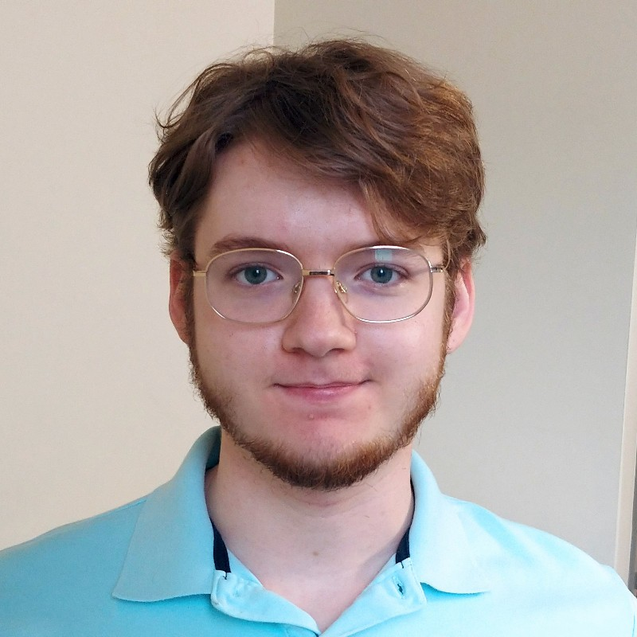

# Demian Yutin

## ECE5160: Fast Robotics
### Spring 2023

I’m a senior studying Computer Science at Cornell, pursuing an Early M.Eng. in 
ECE. I'm interested in learning about robotics and AI.

This webpage serves as a place to submit writeups for labs in ECE 5160: Fast 
Robots, which I am currently taking. Links to each completed lab are below.

## [Lab 1: The Artemis Board](labs/Lab-1)
## [Lab 2: Bluetooth](labs/Lab-2)
## [Lab 3: TOF Sensors](labs/Lab-3)
## [Lab 4: IMU](labs/Lab-4)
## [Lab 5: Motors and Control](labs/Lab-5)
## [Lab 6: PID Speed Control](labs/Lab-6)
## [Lab 7: Kalman Filter](labs/Lab-7)
## [Lab 8: Stunts](labs/Lab-8)
<!-- ## [Lab 9: Mapping](labs/Lab-9)
## [Lab 10: Simulator](labs/Lab-10)
## [Lab 11: Localization](labs/Lab-11)
## [Lab 12: Planning and Execution](labs/Lab-12) -->